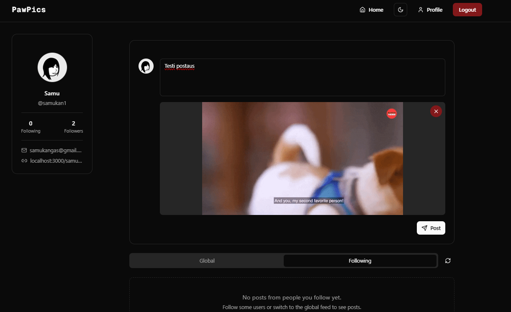

## Screenshots

### Home Feed

### Profile Page

### Post Creation

### Likes & commenting

## Features Implemented

### User Authentication

- Login/Registration system
- Authentication using JWT tokens

### Post Management

- Create posts with text content
- Upload and display images
- Upload and play videos
- Delete own posts

### Social Interaction

- Like/unlike posts
- View like counts
- Add comments to posts
- View all comments on a post

### User Interface

- Responsive design for mobile and desktop
- Dark/light mode support
- Loading states and optimistic updates
- Real-time form validation

### Feed

- View posts from all users
- Filter posts by different criteria
- Infinite scroll for better performance

## API Documentation

Comprehensive API documentation is available at: [https://](https://)

### Main Endpoints:

- `GET /api/posts` - Retrieve posts feed
- `POST /api/posts` - Create a new post
- `GET /api/posts/:id/comments` - Get comments for a post
- `POST /api/posts/:id/comments` - Add a comment to a post

## Database Structure

The application uses a relational database with the following main tables:

### Users

Stores user information including:

- User ID (Primary Key)
- Username
- Email
- Name
- Profile Image
- Created At
- Updated At

### Posts

Stores post information including:

- Post ID (Primary Key)
- User ID (Foreign Key)
- Content
- Image URL
- Video URL
- Created At
- Updated At

### Comments

Stores comments on posts:

- Comment ID (Primary Key)
- Post ID (Foreign Key)
- User ID (Foreign Key)
- Content
- Created At

### Likes

Tracks post likes:

- Like ID (Primary Key)
- Post ID (Foreign Key)
- User ID (Foreign Key)
- Created At

The complete database script can be found in [database/DB.sql](database/DB.sql)

Database Schema :

## Known Issues and Limitations

- Video and picture quality is bad
- No notification system implemented yet
- Profile editing is non-existant

## References and Credits

### Technologies Used

- [Next.js](https://nextjs.org/) - React framework
- [Tailwind CSS](https://tailwindcss.com/) - CSS framework
- [Radix UI](https://www.radix-ui.com/) - UI component library
- [Shadcn UI](https://ui.shadcn.com/) - Component library built on top of Radix
- [Lucide Icons](https://lucide.dev/) - Icon library
- [Uploadthing](https://uploadthing.com/) - File upload

### Learning Resources

- [Next.js Documentation](https://nextjs.org/docs)
- [Tailwind CSS Documentation](https://tailwindcss.com/docs)
- [Build a Social Media App with Next.js](https://www.youtube.com/watch?v=vUYopHWOURg) - Tutorial
